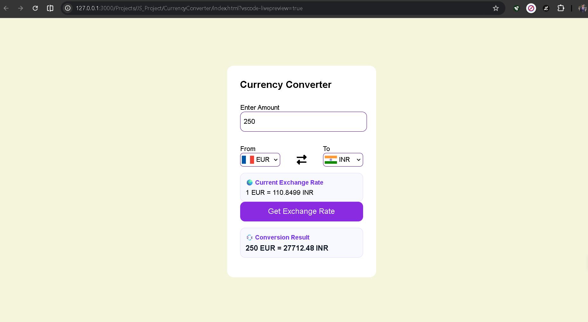

# 💱 Currency Converter

    A responsive Currency Converter web application built using HTML, CSS, and JavaScript. The application fetches real-time exchange rates and allows users to            convert currencies instantly with dynamic country flag updates.

##  🚀 Live Demo

🔗 [Try Currency Converter](https://shashwatss10.github.io/Currency-Converter/) 

## 📸 Preview

## ✨ Features
    - Real-time currency conversion
    - Dynamic country flag updates
    - Supports multiple international currencies
    - Responsive and user-friendly interface
    - Fetch API integration
    - Error handling for API failures
    - Clean and modern design

## 🛠 Technologies Used
    * HTML5
    * CSS3
    * JavaScript (ES6)
    * ExchangeRate API
    * FlagsAPI

## 📂 Project Structure
    CurrencyConverter/
    ├── index.html
    ├── style.css
    ├── app.js
    ├── codes.js
    ├── README.md
    ├── .gitignore
    └── Screenshots/
      └── Currency-Converter.png

## ⚙️ How to Run
    -> Method 1: Open Directly
        Download or clone the repository.
        Open index.html in your browser.
    -> Method 2: Using VS Code
        Install the Live Server extension.
        Open the project folder in VS Code.
        Right-click index.html.
        Select Open with Live Server.

## 🛠 Challenges Faced
    - Handling API responses and errors
    - Managing dynamic currency dropdowns
    - Updating country flags automatically
    - Displaying accurate exchange rates in real time
    - Improving user experience and responsiveness

## 🔮 Future Enhancements
    * Dark Mode
    * Currency Swap Button
    * Conversion History
    * Favorite Currencies
    * Exchange Rate Trend Charts
    * Better Mobile Responsiveness

## 📬 Feedback
    - Suggestions and feedback are always welcome.
    - Feel free to open an issue or connect with me through GitHub.

## Author
    
Shashwat Sharma
GitHub: https://github.com/Shashwatss10
LinkedIn: https://www.linkedin.com/in/shashwat-sharma-139b5a30b
